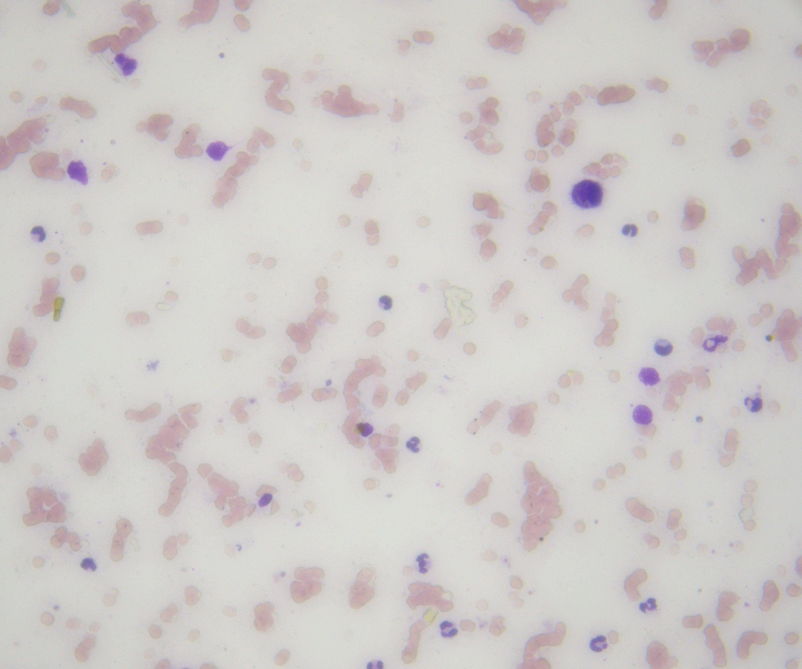
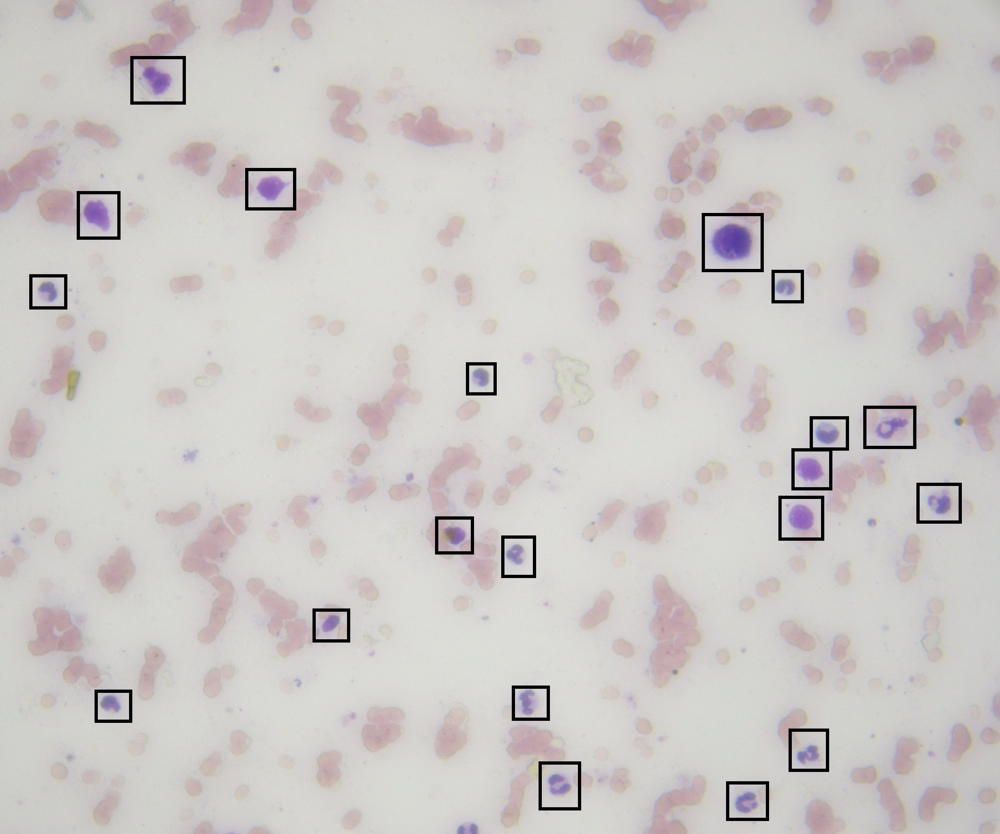

# Cell Counter Challenge

## Introduction
This project is a **technical challenge** for evaluating skills in **WPF and Computer Vision using EmguCV**. The goal is to build a simple cell detection system that counts specific cells in microscope images.

## Task
Implement a **basic cell detection algorithm** that:
- Loads an image from disk.
- Processes the image to detect and count the most violet-colored cells.
- Displays the original and processed image.
- Shows the estimated cell count in a label.

## Getting Started
### Prerequisites
- Windows with .NET 8.0 installed.
- Visual Studio (recommended) or another C# development environment.

### Setup
1. Fork this repository and clone your fork:
   ```sh
   git clone <your-fork-url>
   cd CellCounterChallenge
   ```
2. Open the solution in Visual Studio.
3. Ensure that all dependencies are installed.
4. Run the project.

## Implementation Details
- The **UI is pre-built**, allowing you to focus on implementing the cell detection logic.
- Images to process are in the `Images` folder.
- Modify `ProcessImage_Click` in `MainWindow.xaml.cs` to implement the detection logic.

## Expected Results
- The program should **highlight and count** the most violet-colored cells.
- The result label should display the approximate number of detected cells.
- No perfect accuracy is required, only a reasonable approximation.

### Example
Below is an example of an **original image** and its **processed version**:

#### Original Image:


#### Processed Image:

- The program should **highlight and count** the most violet-colored cells.
- The result label should display the approximate number of detected cells.
- No perfect accuracy is required, only a reasonable approximation.

## Submission
- Push your completed solution to a **GitHub repository** (or send a ZIP file).
- Include a **brief README update** explaining your approach, decisions, problems you faced, etc.

## Notes
- Feel free to adjust the code as desired.
- You can present the result image as you prefeer.
- You may use additional image processing techniques if necessary.

Good luck!

